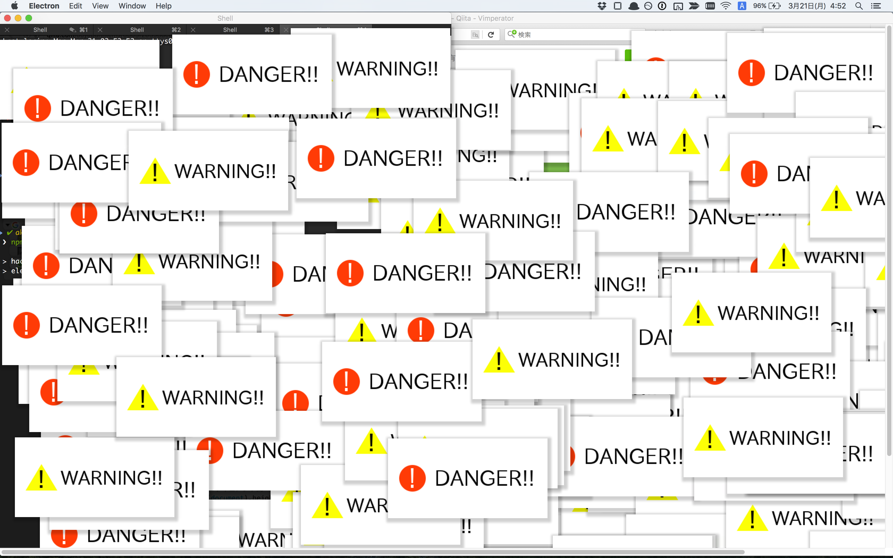

# hacking-now

> desktop notification while be attacked

## DEMO



## Installation

```
$ git clone git@github.com:akameco/hacking-now.git
```

## Usage

```
$ npm install
$ npm build
$ npm start
```


## License

MIT
